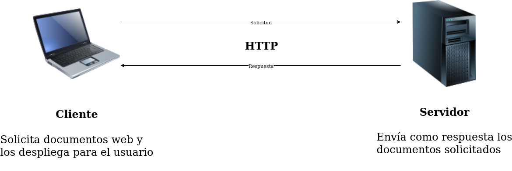
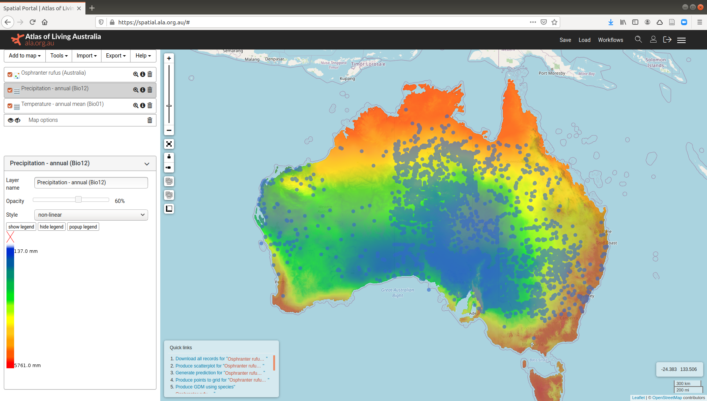
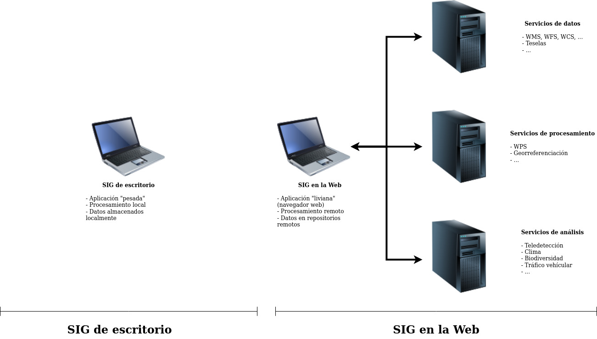
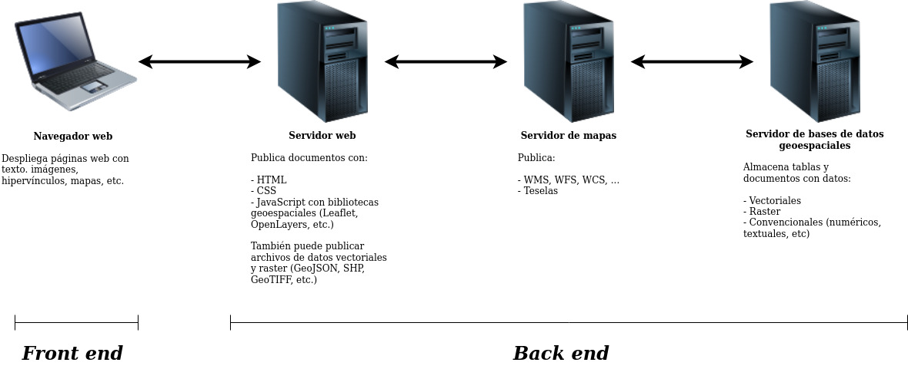

# Sistemas de información geográfica en la Web
Un sistema de información geográfica (SIG) está orientado al manejo de información relacionada con la localización de objetos o fenómenos en el espacio. Un SIG facilita la realización de tareas como:

- Lectura, edición, almacenamiento y, en general, gestión de datos geográficos.
- Generación de visualizaciones tales como mapas, gráficos y tablas.
- Análisis de datos e información geográfica.

En sus inicios, en la década de 1960 (y durante varias décadas subsiguientes), los SIG fueron implementados principalmente como aplicaciones *de escritorio*. Es decir, sistemas de software que funcionan íntegramente en la computadora del usuario, sin acceder a otras computadoras o recursos externos para realizar tareas como las mencionadas anteriormente. Con la paulatina popularización de las redes de computadoras y de la Internet, a partir de la década de 1980, se hizo cada vez más evidente la conveniencia de utilizar la *World Wide Web* (WWW) para realizar de manera ditribuida (i.e. en varias computadoras) estas tareas, así como de aprovechar el potencial de su interfaz, entre otras ventajas.

La WWW, llamada también "la Web", es un sistema de distribución de documentos de hipertexto e hipermedia, llamados también páginas web, interconectados a través del [Protocolo de Transferencia de Hipertexto o HTTP](https://tools.ietf.org/html/rfc7540) (siglas en inglés de *Hypertext Transfer Protocol*), uno de los integrantes de la [familia de protocolos de Internet](https://es.wikipedia.org/wiki/Familia_de_protocolos_de_internet). Con un navegador web, un usuario visualiza sitios web compuestos de páginas web que pueden contener textos, imágenes, vídeos u otros contenidos multimedia, permitiendo la navegación a través de esas páginas mediante hiperenlaces. Los sitios web se alojan en servidores que responden a las solicitudes de los clientes (i.e. navegadores web), de acuerdo con el [modelo cliente-servidor](https://en.wikipedia.org/wiki/Client%E2%80%93server_model), como se muestra en la figura 1.

<p>
<figure><figcaption><small><strong>Figura 1.</strong> Protocolo HTTP.</small></figcaption></figure>  
<p>

[La WWW fue creada en 1989](https://home.cern/science/computing/birth-web) por el científico inglés Tim Berners-Lee, como parte de su trabajo en la Organización Europea para la Investigación Nuclear (CERN, *Conseil européen pour la recherche nucléaire*). Fue concebida originalmente como parte de un sistema para que los investigadores del CERN utilizaran y compartieran documentos con investigadores de otros centros de investigación.

Los SIG en la Web permiten, por ejemplo, visualizar en un navegador de Internet mapas elaborados con datos geoespaciales almacenados en repositorios remotos o acceder servicios de geoprocesamiento disponibles en servidores administrados por terceros. En la figura 2 se muestra un ejemplo de SIG en la Web.

<p>
<figure><figcaption><small><strong>Figura 2. </strong><a href="https://spatial.ala.org.au/">Portal geoespacial del Atlas of Living Australia</a> que muestra registros de presencia del canguro rojo (<em>Osphranter rufus</em>) sobre capas raster de temperatura y precipitación.</small></figcaption></figure>  
<p>

Algunas de las diferencias mencionadas entre los SIG de escritorio y los SIG en la Web se ilustran en la figura 3.

<p>
<figure><figcaption><small><strong>Figura 3.</strong> SIG de escritorio y SIG en la Web.</small></figcaption></figure>  
<p>
    
Adicionalmente, en la tabla 1 se comparan algunas características de ambos tipos de SIG.

<p>
<table style="width:80%">
    <caption><strong>Tabla 1. </strong>Comparación de características de los SIG de escritorio y los SIG en la Web</caption>
    <tr>
        <th>SIG de escritorio</th>
        <th>SIG en la Web</th>
    </tr>
    <tr>
        <td>Aplicación "pesada": consume una gran cantidad de espacio en disco, así como memoria y procesador</td>
        <td>Aplicación "liviana" (navegador web): consume menos recursos</td>
    </tr>
    <tr>
        <td>Funcionalidades diversas</td>
        <td>Funcionalidad orientada a tareas específicas</td>
    </tr>
    <tr>
        <td>Interfaz de usuario compleja</td>
        <td>Interfaz de usuario sencilla</td>
    <tr>
    <tr>
        <td>Para usuarios especializados</td>
        <td>Para usuarios no especializados</td>
    </tr>
    <tr>
        <td>Mantiene los datos en medios locales de almacenamiento (ej. en discos duros)</td>
        <td>Usa datos en repositorios remotos (ej. servidores de bases de datos, servidores de mapas con servicios como WMS, WFS y otros)</td>
    </tr>
    <tr>
        <td>El procesamiento se realiza localmente, en la computadora del usuario</td>
        <td>El procesamiento se realiza en servidores remotos</td>
    </tr>
</table>
<p>

## Tecnologías utilizadas en el desarrollo de SIG en la Web
En general, las tecnologías que se utilizan en el desarrollo de aplicaciones para la Web pueden dividirse en dos grupos: las de *front end* y las de *back end*. El *front end* se encarga de presentarle los datos al usuario (ej. en mapas) y capturar sus instrucciones para manipularlos (ej. alejamientos, acercamientos, filtros, análisis). El *back end* procesa los datos de acuerdo con estas instrucciones. Típicamente, en el caso de los SIG en la Web, el *front end* se implementa en un navegador web y el *back end* a través de servidores de mapas y de bases de datos geoespaciales, entre otros. Los componentes del *front end* y del *back end* se ilustran en la figura 4.

<p>
    <figure>
        <figcaption>
            <small><strong>Figura 4. </strong><em>Front end</em> y <em>back end</em> de SIG en la Web.</small>
        </figcaption>
    </figure>  
<p>

A continuación, se describen las principales tecnologías utilizadas tanto en el *front end* como en el *back end*.

### *Front end*
Las tres principales tecnologías que se utilizan en el desarrollo de aplicaciones web en el *front end* son el lenguaje de marcas HTML, el lenguaje de diseño gráfico CSS y el lenguaje de programación JavaScript.

#### HTML
El [Lenguaje de Marcas de Hipertexto o HTML](https://html.spec.whatwg.org/) (siglas en inglés de *Hypertext Markup Language*) es el lenguaje de marcas estándar para documentos diseñados para desplegarse en un navegador web. Fue creado en 1990 por Tim Berners-Lee.

El HTML especifica la estructura y la semántica de una página web mediante marcas o *tags*. Un navegador web recibe documentos HTML desde un servidor web (o desde almacenamiento local) y despliega sus componentes (textos, imágenes, hiperenlaces, etc.) de acuerdo con las especificaciones contenidas en los *tags.*

El siguiente [ejemplo de documento HTML](https://github.com/tpb729-desarrollosigweb-2021/leccion-01-sigweb/blob/main/tim-berners-lee-html.html) contiene, entre otros, *tags* para el título del documento (```<title></title>```), encabezados (```<h1></h1>, <h2></h2>```), una imagen (``````) y un hipervínculo (```<a></a>```).

```html
<!DOCTYPE html>
<html lang="es">
<head>
    <meta charset="UTF-8">
    <title>Tim Berners-Lee</title>     
</head>
<body>
    <h1>Tim Berners-Lee</h1>
    Sir Timothy John Berners-Lee es un científico de la computación inglés, conocido por crear la World Wide Web (WWW).    
    <p>
    
    
    <h2>Información general</h2>
    Tim Berners-Lee nació en el sudoeste de Londres, Reino Unido, el 8 de junio de 1955. 
    
    <h2>Creación de la WWW</h2>
    Tim Berners-Lee creó la WWW en 1989 como parte de su trabajo en la <a href="https://home.cern/">Organización Europea para la Investigación Nuclear (CERN)</a>.
</body>
</html>
```
La página web que se despliega como producto del documento HTML anterior se muestra en la figura 5.

<p>
<figure><figcaption><small><strong>Figura 5.</strong> <a href="https://tpb729-desarrollosigweb-2021.github.io/leccion-01-sigweb/tim-berners-lee-html.html">Página web generada mediante HTML</a>.</small></figcaption></figure>  
<p>

EL HTML es un estándar del [World Wide Web Consortium (W3C)](https://www.w3.org/), un consorcio internacional creado por Tim Berners-Lee en 1994 que genera recomendaciones y estándares que aseguran el crecimiento de la WWW a largo plazo. La versión más reciente del estándar es [HTML5](https://www.w3.org/TR/2017/REC-html52-20171214/) y se caracteriza por incluir soporte para los tipos más recientes de multimedios y reducir la necesidad de plataformas propietarias (ej. [Adobe Flash](https://en.wikipedia.org/wiki/Adobe_Flash)) para su incorporación en páginas web que pueden desplegarse en diferentes tipos de dispositivos y tamaños de pantallas (computadoras, tabletas, teléfonos, pantallas gigantes, etc.).

#### CSS
[Hojas de Estilo en Cascada o CSS](https://www.w3.org/TR/CSS/#css) (siglas en inglés de *Cascading Style Sheets*) es un lenguaje de diseño gráfico para describir la presentación de un documento escrito en un lenguaje de marcas (ej. HTML). Permite especificar aspectos de diseño como colores, tipos y tamaños de letra, márgenes, alineamientos y muchos otros.

CSS permite manejar la presentación separadamente del contenido, lo que brinda una mayor una flexibilidad en el diseño. Por ejemplo, varios archivos HTML pueden compartir una misma presentación al hacer referencia a un mismo archivo CSS. También posibilita un despliegue diferenciado de acuerdo a los tipos y tamaños de pantallas, en conjunto con HTML5.

Al igual que HTML, CSS es un estándar de W3C. Fue propuesto por Håkon Wium Lie, quien trabajaba en CERN con Tim Berners-Lee, en 1994.

CSS especifica el estilo de un documento mediante propiedades de sus diferentes elementos. Seguidamente, se presenta un [ejemplo de documento CSS](https://github.com/tpb729-desarrollosigweb-2021/leccion-01-sigweb/blob/main/css/estilos.css) que define varias propiedades de los encabezados y del cuerpo principal del documento HTML mostrado anteriormente.

```css
body {
    background-color:black;
    color:white;
    font-family:Arial;
    margin:0 4px 0 0;
    border:3px solid;
}

h1 {
    color:blue;
}       

h2 {
    color:gray;
}   
```

El resultado de la aplicación de estos estilos se muestra en la figura 6.

<p>
<figure><figcaption><small><strong>Figura 6.</strong> <a href="https://tpb729-desarrollosigweb-2021.github.io/leccion-01-sigweb/tim-berners-lee-css.html">Página web con estilos especificados mediante CSS</a>.</small></figcaption></figure>  
<p>

#### JavaScript
[JavaScript](https://es.wikipedia.org/wiki/JavaScript) es un lenguaje de programación utilizado para añadir interactividad a las páginas web. Fue creado en 1995 por Brendan Eich, con el fin de dar interactividad a las páginas web leídas con el navegador [Netscape](https://en.wikipedia.org/wiki/Netscape_%28web_browser%29). En la actualidad, es utilizado por todos los [principales navegadores web](https://en.wikipedia.org/wiki/Usage_share_of_web_browsers) y en la mayoría de los sitios web.

Mediante JavaScript es posible:

- Controlar multimedia.
- Reaccionar a "eventos" (ej. presionar un botón).
- Modificar dinámicamente el contenido de una página web.
- Manejar mapas interactivos.

El siguiente [ejemplo de código JavaScript](https://github.com/tpb729-desarrollosigweb-2021/leccion-01-sigweb/blob/main/js/funciones.js) define una función. La figura 7 muestra el resultado de su ejecución desde un documento HTML.

```js
function desplegarFechaHora () {
  document.getElementById('fechaYhora').innerHTML = Date();
}
```

<p>
<figure><figcaption><small><strong>Figura 7.</strong> <a href="https://tpb729-desarrollosigweb-2021.github.io/leccion-01-sigweb/tim-berners-lee-js.html">Página web con botón que llama a función en JavaScript que despliega la fecha y la hora</a>.</small></figcaption></figure>  
<p>

##### Bibliotecas geoespaciales
Hay varias bibliotecas de JavaScript que permiten incorporar mapas en páginas web, junto con controles para realizar algunas acciones como acercamientos, alejamientos, búsquedas y otros. También facilitan la generación de análisis y visualizaciones como mapas de coropletas (*choropleth maps*), mapas de calor (*heat maps*) y mapas de agrupaciones (*cluster maps*). El código fuente en JavaScript se invoca desde *tags* de HTML. Usualmente, estas bibliotecas se distribuyen con un conjunto de hojas de estilo (CSS).

Algunas de las más populares de estas bibliotecas son [Leaflet](https://leafletjs.com/), [OpenLayers](https://openlayers.org/) y [Google Maps](https://developers.google.com/maps/documentation).

### *Back end*
En el *back end* pueden utilizarse una gran cantidad de tecnologías. Aquí se destaca el lenguaje SQL, para bases de datos, y lenguajes y entornos de ejecución utilizados en servidores web y para acceso a datos.

#### SQL
El [Lenguaje de Consulta Estructurada o SQL](https://es.wikipedia.org/wiki/SQL) (siglas en inglés de *Structured Query Language*) es un lenguaje de programación para consulta y gestión de datos. Fue creado en 1974 por Donald D. Chamberlin y Raymond F. Boyce. Es ampliamente utilizado en [bases de datos relacionales](https://es.wikipedia.org/wiki/Base_de_datos_relacional) y algunas de sus variantes se utilizan también en [bases de datos NoSQL](https://es.wikipedia.org/wiki/NoSQL).

Los principales motores de bases de datos implementan tipos de datos geométricos (puntos, líneas, polígonos, etc.) que pueden consultarse y editarse con funciones SQL. Estas extensiones espaciales de los motores de bases de datos están basadas en estándares como [Simple Features](https://www.ogc.org/standards/sfa).

#### Lenguajes y entornos de ejecución para servidores
Hay una gran cantidad de lenguajes que se utilizan para ejecutar procesos en los servidores. Algunos de los principales son [PHP](https://www.php.net/), [Python](https://www.python.org/), [Ruby](https://www.ruby-lang.org/) y el entorno de ejecución [Node.js](https://nodejs.org/).

## Recursos adicionales
- [MDN Web Docs](https://developer.mozilla.org/)
- [W3Schools](https://www.w3schools.com/)

## Ejercicios
1. Cree en [CodePen](https://codepen.io/) un *pen* sobre Tim-Berners-Lee.  
  1.1. Ingrese a [CodePen](https://codepen.io/) (puede hacerlo con su cuenta de GitHub) y cree un *pen*.  
  1.2. Agregue el siguiente contenido para cada sección (note los cambios que se producen en la página web al incorporar cada una de las secciones):  

HTML
```html
<!DOCTYPE html>
<html lang="es">
<head>
    <title>Tim Berners-Lee</title>     

    <meta charset="UTF-8">
    <link rel="stylesheet" href="css/estilos.css">
    <script src="js/funciones.js"></script>    
</head>
<body>
    <h1>Tim Berners-Lee</h1>
    Sir Timothy John Berners-Lee es un científico de la computación inglés, conocido por crear la World Wide Web (WWW).    
    <p>
    
    
    <h2>Información general</h2>
    Tim Berners-Lee nació en el sudoeste de Londres, Reino Unido, el 8 de junio de 1955. 
    
    <h2>Creación de la WWW</h2>
    Tim Berners-Lee creó la WWW en 1989 como parte de su trabajo en la <a href="https://home.cern/">Organización Europea para la Investigación Nuclear (CERN)</a>.
  
    <p>
    
    <button type="button" onclick="desplegarFechaHora()">
      Presione para desplegar la fecha y la hora
    </button>

    <p id="fechaYhora"></p>  
</body>
</html>
```

CSS
```css
body {
    background-color:black;
    color:white;
    font-family:Arial;
    margin:0 4px 0 0;
    border:3px solid;
}

h1 {
    color:blue;
}       

h2 {
    color:gray;
}   
```

JS
```js
function desplegarFechaHora () {
  document.getElementById('fechaYhora').innerHTML = Date();
}
```

  1.3. En la sección de HTML, puede dejar únicamente la parte que corresponde al ```body``` del documento.  
  1.4. Guarde su *pen* y asígnele un nombre (ej. "Biografía de Tim Berners-Lee").  
  1.5. Realice cambios en el código HTML, CSS y JavaScript y observe como se afecta la página web resultante. Sugerencias: agregue más texto, cambie los colores, cambie el tamaño de las letras, cambie el texto que se despliega al presionar el botón, ...

2. Cree en [GitHub](https://github.com/) un sitio web sobre Tim-Berners-Lee.
  2.1. Ingrese a [GitHub](https://github.com/) y cree un repositorio llamado "tim-berners-lee".  
  2.2. Clone el repositorio en su computadora con el comando ```git clone```. Debe tener instalado el programa [Git](https://git-scm.com/).  
  2.3. En el directorio clonado, cree un archivo llamado "index.html" con el código HTML del ejercicio 1. Abra el archivo con un navegador web.  
  2.4. Cree subdirectorio llamado "css" y un archivo llamado "css/estilos.css" con el código CSS del ejercicio 1. Abra (o refresque) de nuevo el archivo HTML y observe los cambios.  
  2.5. Cree un subdirectorio llamado "js" y un archivo llamado "js/funciones.js" con el código JavaScript del ejercicio 1. Abra (o refresque) de nuevo el archivo HTML y observe los cambios.  
  2.6. Cree un subddirectorio llamado "img" y coloque ahí la imagen en "https://github.com/tpb729-desarrollosigweb-2021/leccion-01-sigweb/raw/main/img/tim-berners-lee-128px.jpg". Modifique el archivo HTML para que utilice esta imagen local y no la que está en GitHub.  
  2.7. Actualice el repositorio con los comandos ```git status```, ```git add```, ```git commit``` y ```git push```.  
  2.8. En GitHub, cree un sitio web con GitHub Pages y observelo en su navegador web.
