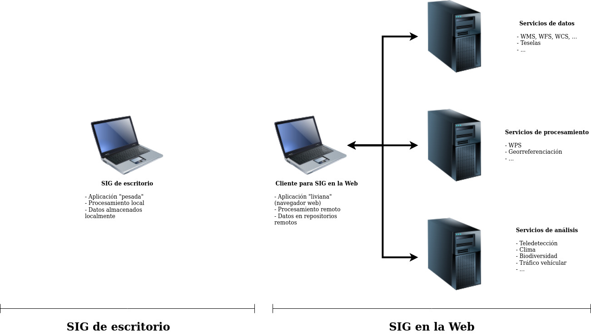

# Sistemas de información geográfica en la Web
Un sistema de información geográfica (SIG) es aquel que está orientado al manejo de información relacionada con la localización de objetos o fenómenos en el espacio. Esta localización se expresa en el contexto de un sistema de coordenadas, como el [sistema de coordenadas geográficas](https://es.wikipedia.org/wiki/Coordenadas_geogr%C3%A1ficas), el cual permite especificar la ubicación de cualquier lugar en la Tierra mediante su longitud y latitud.

En un entorno de manejo de datos geográficos (o, en general, espaciales), un SIG facilita la realización de tareas como:

- Lectura, edición, almacenamiento y, en general, gestión de datos.
- Generación de visualizaciones tales como mapas, gráficos y tablas.
- Análisis de datos.

En sus inicios, en la década de 1960 (y durante varias décadas subsiguientes), los SIG fueron implementados principalmente como aplicaciones *de escritorio*. Es decir, sistemas de software que funcionan íntegramente en la computadora del usuario, sin acceder a otras computadoras o recursos externos para realizar tareas como las mencionadas anteriormente. Con la paulatina popularización de las redes de computadoras y de la Internet, a partir de la década de 1980, se hizo cada vez más evidente la conveniencia de utilizar la *World Wide Web* (WWW) para realizar de manera ditribuida (i.e. en varias computadoras) estas tareas. 

La WWW, llamada también "la Web", es un sistema de distribución de documentos de hipertexto o hipermedia interconectados y accesibles a través del [Protocolo de Transferencia de Hipertexto (HTTP)](https://tools.ietf.org/html/rfc7540) (siglas en inglés de *Hypertext Transfer Protocol*), uno de los integrantes de la [familia de protocolos de Internet](https://es.wikipedia.org/wiki/Familia_de_protocolos_de_internet). Con un navegador web, un usuario visualiza sitios web compuestos de páginas web que pueden contener textos, imágenes, vídeos u otros contenidos multimedia, permitiendo la navegación a través de esas páginas usando hiperenlaces. La WWW fue creada en 1989 por el científico inglés Tim Berners-Lee, como parte de su trabajo en la Organización Europea para la Investigación Nuclear (CERN, *Conseil européen pour la recherche nucléaire*). Fue concebida originalmente como parte de un sistema para que los investigadores del CERN utilizaran y compartieran documentos.

Los SIG en la Web permiten, por ejemplo, visualizar en un navegador de Internet mapas elaborados con datos geoespaciales almacenados en repositorios remotos o acceder servicios de geoprocesamiento disponibles en servidores administrados por terceros. Estas diferencias entre los SIG de escritorio y los SIG en la Web, se ilustran en la figura 1.

<p>
<figure><figcaption><small><strong>Figura 1.</strong> SIG de escritorio y SIG en la Web.</small></figcaption></figure>  
<p>
    
Adicionalmente, en la tabla 1 se comparan algunas características de ambos tipos de SIG.

<p>
<table style="width:80%">
    <caption><strong>Tabla 1. </strong>Comparación de características de los SIG de escritorio y los SIG en la Web</caption>
    <tr>
        <th>SIG de escritorio</th>
        <th>SIG en la Web</th>
    </tr>
    <tr>
        <td>Aplicación "pesada": consume una gran cantidad de espacio en disco, así como memoria y procesador</td>
        <td>Aplicación "liviana" (navegador web): consume menos recursos</td>
    </tr>
    <tr>
        <td>Funcionalidades diversas</td>
        <td>Funcionalidad orientada a tareas específicas</td>
    </tr>
    <tr>
        <td>Interfaz de usuario compleja</td>
        <td>Interfaz de usuario sencilla</td>
    <tr>
    <tr>
        <td>Para usuarios especializados</td>
        <td>Para usuarios no especializados</td>
    </tr>
    <tr>
        <td>Mantiene los datos en medios locales de almacenamiento (ej. en discos duros)</td>
        <td>Usa datos en repositorios remotos (ej. servidores de bases de datos, servidores de mapas con servicios como WMS, WFS y otros)</td>
    </tr>
    <tr>
        <td>El procesamiento se realiza localmente, en la computadora del usuario</td>
        <td>El procesamiento se realiza en servidores remotos</td>
    </tr>
</table>
<p>

## Tecnologías utilizadas en el desarrollo de SIG en la Web
Las tecnologías utilizadas en el desarrollo de aplicaciones para la Web pueden dividirse en dos grupos: las de *front end* y las de *back end*. El *front end* se encarga de presentarle los datos al usuario (ej. en mapas) y capturar sus instrucciones para manipularlos (ej. alejamientos, acercamientos, filtros, selecciones). El *back end* procesa los datos de acuerdo con estas instrucciones. Típicamente, en el caso de los SIG en la Web, el *front end* se implementa en un navegador web y el *back end* a través de servidores de mapas y de bases de datos geoespaciales, entre otros. Los componentes del *front end* y del *back end* se ilustran en la figura 2.

<p>
    <figure>
        <figcaption>
            <small><strong>Figura 2. </strong><em>Front end</em> y <em>back end</em>.</small>
        </figcaption>
    </figure>  
<p>

A continuación, se describen las principales tecnologías utilizadas tanto en el *front end* como en el *back end*.

### *Front end*

#### HTML
El [Lenguaje de Marcas de Hipertexto o HTML](https://html.spec.whatwg.org/) (siglas en inglés de *Hypertext Markup Language*) es el lenguaje de marcas estándar para documentos diseñados para desplegarse en un navegador web. Junto con CSS (*Cascading Style Sheets*) y JavaScript, conforma el grupo de las tres sintaxis principales de la Web. Fue creado en 1990 por Tim Berners-Lee, como una de las tecnologías que fundamentan la WWW.

El HTML especifica la estructura y la semántica de una página web mediante marcas o *tags*. Un navegador web recibe documentos HTML de un servidor web (o de almacenamiento local) y despliega sus componentes (textos, imágenes, hipervínculos, etc.) de acuerdo con las especificaciones contenidas en los *tags.*

El siguiente documento HTML contiene, entre otros, *tags* para el título del documento (```<title></title>```), encabezados (```<h1></h1>, <h2></h2>```), una imagen (``````) y un hipervínculo (```<a></a>```).

```html
<!DOCTYPE html>
<html lang="es">
<head>
    <meta charset="UTF-8">
    <title>Tim Berners-Lee</title>     
</head>
<body>
    <h1>Tim Berners-Lee</h1>
    Sir Timothy John Berners-Lee es un científico de la computación inglés, conocido por crear la World Wide Web (WWW).    
    <p>
    
    
    <h2>Información general</h2>
    Tim Berners-Lee nació en el sudoeste de Londres, Reino Unido, el 8 de junio de 1955. 
    
    <h2>Creación de la WWW</h2>
    Tim Berners-Lee creó la WWW en 1989 como parte de su trabajo en la <a href="https://home.cern/">Organización Europea para la Investigación Nuclear (CERN)</a>.
</body>
</html>
```
La página web que se despliega como producto del documento HTML anterior se muestra en la figura 3.

<p>
<figure><figcaption><small><strong>Figura 3.</strong> <a href="https://tpb729-desarrollosigweb-2021.github.io/leccion-01-sigweb/tim-berners-lee-html.html">Página web generada mediante HTML</a>.</small></figcaption></figure>  
<p>

EL HTML es un estándar del [World Wide Web Consortium (W3C)](https://www.w3.org/), un consorcio internacional creado por Tim Berners-Lee en 1994 que genera recomendaciones y estándares que aseguran el crecimiento de la WWW a largo plazo. La versión más reciente del estándar es [HTML5](https://www.w3.org/TR/2017/REC-html52-20171214/). Se caracteriza por incluir soporte para los tipos más recientes de multimedios y reducir la necesidad de plataformas propietarias (ej. [Adobe Flash](https://en.wikipedia.org/wiki/Adobe_Flash)) para su incorporación en páginas web que pueden desplegarse en diferentes tipos de dispositivos y tamaños de pantallas (computadoras, tabletas, teléfonos, pantallas gigantes, etc.).

#### CSS
[Hojas de Estilo en Cascada o CSS](https://www.w3.org/TR/CSS/#css) (siglas en inglés de *Cascading Style Sheets*) es un lenguaje de diseño gráfico para describir la presentación de un documento escrito en un lenguaje de marcas (ej. HTML). Permite especificar aspectos de diseño como colores, tipos y tamaños de letra, márgenes, alineamientos y muchos otros.

CSS permite manejar la presentación separadamente del contenido, lo que brinda una mayor una flexibilidad en el diseño. Por ejemplo, varios archivos HTML pueden compartir una misma presentación al hacer referencia a un mismo archivo CSS. También posibilita un despliegue diferenciado de acuerdo a los tipos y tamaños de pantallas.

Al igual que HTML, CSS es un estándar de W3C. Fue propuesto por Håkon Wium Lie, quien trabajaba en CERN con Tim Berners-Lee, en 1994.

CSS especifica el estilo de un documento mediante propiedades de sus diferentes elementos. Seguidamente, se utiliza la sintaxis de CSS para especificar varias propiedades de los encabezados y del cuerpo principal de un documento HTML.

```css
body {
    background-color:black;
    color:white;
    font-family:Arial;
    margin:0 4px 0 0;
    border:12px solid;
}

h1 {
    color:blue;
    background-color:yellow;
}
```

#### JavaScript

##### Bibliotecas geoespaciales

### *Back end*

#### Servicios web

#### Bases de datos geoespaciales

## Recursos externos
- Sistemas de Información Geográfica, de Víctor Olaya (https://volaya.github.io/libro-sig/)
